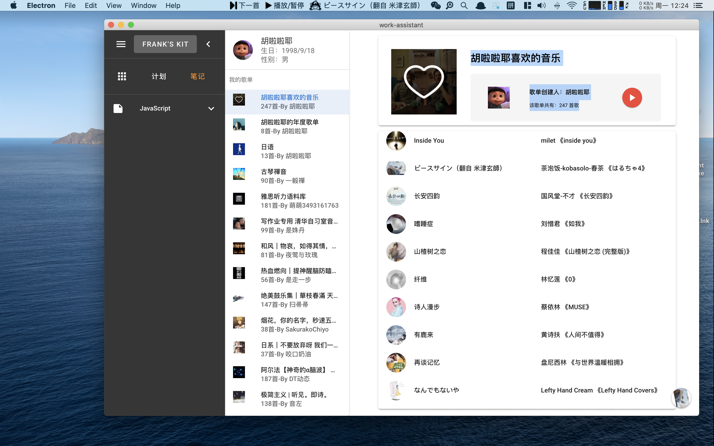
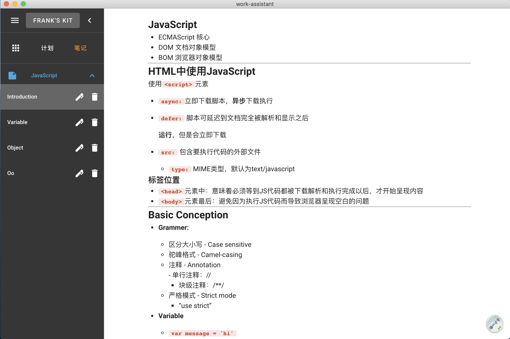
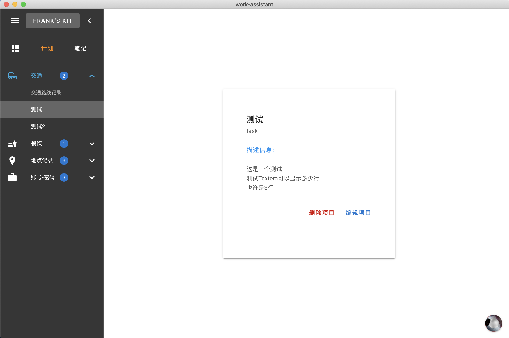

# work-assistant

PC端个人学习工具，Markdown笔记记录、计划记录、网易云听歌

集成
[网易云API](https://binaryify.github.io/NeteaseCloudMusicApi/#/?id=neteasecloudmusicapi)
、
[Mavon-edit](https://github.com/hinesboy/mavonEditor)







## Project setup
```
npm install
```

### Compiles and hot-reloads for development
```
npm run electron:serve
```

### Compiles and minifies for production
```
npm run electron:build
npm run electron:build -win
```
